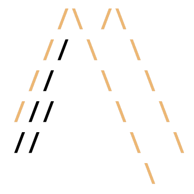

#### pinewall-config - Immutable K8s Wolfi OS node


* `config/etc/apk/world` defines the packages
* the files in etc are the config files that get overlayed over the apk defaults
* genapkovl-pinewall.sh defines the services
* interfaces are in `config/etc/network/interfaces`
* `config/etc/nftables.d/rules.nft` sets up NAT and firewall rules

#### TODO

```
parted /dev/sda resizepart 2 100% --script
resize2fs /dev/sda2
```
